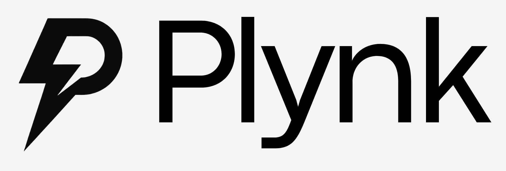
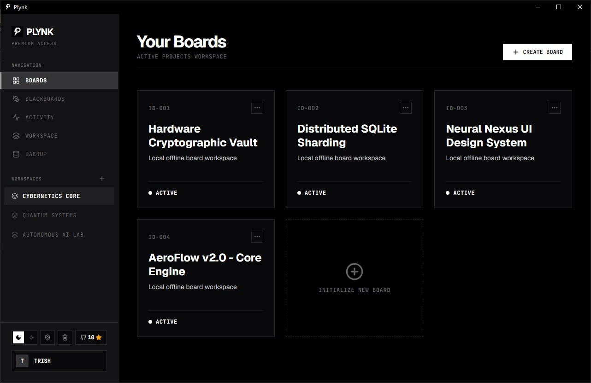

<p align="center">
  
</p>

<p align="center">
  <strong>High-Performance, 100% Offline Brutalist Kanban & Whiteboard Desktop Workspace</strong>
</p>

<p align="center">
  
  
  
  
  <a href="https://github.com/TrisH0x2A/plynk"></a>
</p>

<p align="center">
  
</p>

---

## Overview

Plynk is an ultra-fast, local-first Kanban and whiteboard desktop application built from the ground up for developers and power users who value speed, privacy, and minimalist brutalist aesthetics.

Unlike cloud-dependent task management software, Plynk executes completely locally on your system, persists all state in an embedded SQLite database (`plynk.db`), and requires zero network access, zero account creation, and zero external telemetry.

---

## Design System: Tech-Noir & Pure Monochrome

Plynk is engineered around a high-contrast industrial monochrome design language:

- **Dark Mode**: Deep charcoal and obsidian canvas (`#000000` / `#09090B`), sharp zinc borders, stark white typography, and blackboards.
- **Light Mode**: Inverted paper-white canvas (`#FFFFFF` / `#F4F4F5`), solid dark ink borders, deep high-contrast status accents, and whiteboards.
- **Micro-Interactions**: Hardware-accelerated transitions, fluid drag-and-drop feedback, and streamlined keyboard shortcuts.

---

## Core Features

- **Workspace Architecture**: Organize projects across multiple discrete workspaces with isolated boards, lists, and activity streams.
- **Fluid Drag & Drop**: Instant list and card reordering powered by `@hello-pangea/dnd` with edge auto-scrolling.
- **Status & Label System**: Rich card lifecycle management (**ACTIVE**, **IN PROGRESS**, **COMPLETED**, **POSTPONED**) with classification tags.
- **Vector Whiteboard Canvas**: Infinite 2D whiteboard and blackboard with pressure-sensitive drawing, geometric shapes, sticky notes, text labels, and color controls.
- **Recycle Bin & Recovery**: Soft delete and restore system for workspaces, boards, whiteboards, lists, and cards.
- **System Activity Timeline**: Detailed chronological audit logging tracking structural events, renames, status transitions, and administrative actions.
- **Local Backup & Restore**: One-click binary SQLite database snapshot export and restore to any folder on your disk.
- **Middle-Click Pan Navigation**: Seamless mouse navigation across boards and canvas views.
- **Persistent Theme Switcher**: Instant switching between pure Monochrome Dark and Monochrome Light themes.
- **Zero Telemetry & 100% Privacy**: All cards, boards, whiteboards, and logs remain strictly on your local disk.

---

## Download & Installation

Pre-compiled standalone binaries are available on the [Releases Page](https://github.com/TrisH0x2A/plynk/releases).

### Windows
1. Download the latest `.msi` or `.exe` installer.
2. Run the setup installer and launch Plynk from your Start Menu or Desktop.

### Linux (Debian / Ubuntu)
1. Download the latest `.deb` package.
2. Install via terminal:
   ```bash
   sudo dpkg -i plynk_*_amd64.deb
   ```

### Linux (AppImage)
1. Download the `.AppImage` file.
2. Make it executable and run:
   ```bash
   chmod +x Plynk_*.AppImage
   ./Plynk_*.AppImage
   ```

---

## Build from Source

### Prerequisites

- **Node.js**: v18 or later
- **pnpm**: `npm install -g pnpm`
- **Rust**: Latest stable toolchain (`rustup default stable`)

### Steps

1. **Clone the repository**:
   ```bash
   git clone https://github.com/TrisH0x2A/plynk.git
   cd plynk
   ```

2. **Install dependencies**:
   ```bash
   pnpm install
   ```

3. **Run in development mode**:
   ```bash
   pnpm tauri:dev
   ```

4. **Build production binaries**:
   ```bash
   pnpm tauri:build
   ```
   Compiled output binaries are saved to `src-tauri/target/release/bundle/`.

---

## Tech Stack

| Layer | Technologies |
| :--- | :--- |
| **Desktop Core** | [Tauri v2](https://tauri.app/) (Rust 2021) |
| **Database** | Embedded [SQLite](https://www.sqlite.org/) via `rusqlite` (Bundled) |
| **Frontend** | [React 18](https://react.dev/), [TypeScript](https://www.typescriptlang.org/), [Vite](https://vitejs.dev/) |
| **State & Cache** | [TanStack React Query v5](https://tanstack.com/query/latest), [Zustand](https://zustand-demo.pmnd.rs/) |
| **Styling** | [TailwindCSS](https://tailwindcss.com/), Radix UI Primitives, Lucide Icons |
| **Package Manager** | [pnpm](https://pnpm.io/) |

---

## License

Distributed under the **MIT License**. See [`LICENSE`](./LICENSE) for details.
